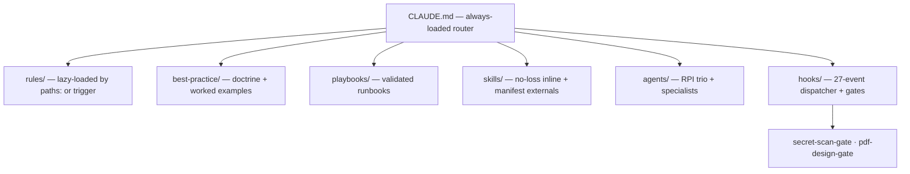
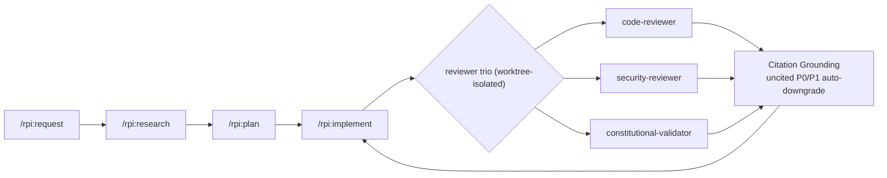

# dotclaude

  

> The working `~/.claude/` configuration of a senior AI engineer — version-controlled, bootstrap-able on any machine, and opinionated by design.

`dotclaude` turns a blank Claude Code install into a production AI-engineering workstation: lazy-loaded rule routing, the four-phase **RPI** (Research → Plan → Implement) workflow with an adversarial reviewer trio in worktree isolation, Citation Grounding with auto-downgrade on P0/P1 findings, a 27-event hook dispatcher, Tavily-first search routing, five first-party skill repos installed from `skills.manifest.toml` by `bootstrap.sh`, and a security posture that keeps every secret out of the repo.

**Inspiration**: [shanraisshan/claude-code-best-practice](https://github.com/shanraisshan/claude-code-best-practice). dotclaude diverges in three places: it lives at user scope (not project scope), it carries a working RPI workflow instead of a weather demo, and it bakes Citation Grounding from [`/critical-harness`](https://github.com/hashbulla/critical-harness) into the review trio.

---

## Highlights

- **RPI workflow with an adversarial reviewer trio** — research → plan → implement, then code/security/constitutional reviewers gate every phase in worktree isolation.
- **Citation Grounding with auto-downgrade** — a reviewer that can't cite a P0/P1 finding has it auto-downgraded, so findings can't be softened to dodge evidence.
- **An executable config-drift gate** — `scripts/audit-config.sh` makes the doctrine's ceiling enforceable, not aspirational.
- **A 27-event hook dispatcher + cheap-and-irreversible gates** — a TDD'd secret-scan gate (16/16 green) and a PDF-design gate, locked only where skipping is irreversible.
- **Secrets posture** — every secret stays out of the repo via `.example` scaffolding + gitignore; verified clean across all history.

---

## Table of contents

1. [Highlights](#highlights)
2. [🧠 Concepts](#-concepts)
3. [🚀 Quick start](#-quick-start)
4. [🤖 Agents (RPI + extras)](#-agents-rpi--extras)
5. [🎯 Slash commands](#-slash-commands)
6. [🧪 Skills](#-skills)
7. [📐 Rules (lazy-loaded)](#-rules-lazy-loaded)
8. [🔔 Hooks (27 events)](#-hooks-27-events)
9. [🔧 MCP registry](#-mcp-registry)
10. [🔍 Search routing](#-search-routing)
11. [📚 Playbooks](#-playbooks)
12. [🔁 The RPI workflow](#-the-rpi-workflow)
13. [⚙️ Configuration hierarchy](#-configuration-hierarchy)
14. [🧱 Config drift gate](#-config-drift-gate)
15. [🔐 Security & secrets](#-security--secrets)
16. [🛣️ Roadmap](#-roadmap)
17. [🙏 Credits](#-credits)

---

## 🧠 Concepts

The repo is layered. Each layer has one job; doctrine is on disk before code.

| Layer | Asset | Doctrine | Status |
|---|---|---|---|
| Every-session context | [`CLAUDE.md`](CLAUDE.md), `@identity.md`, `@profile.md`, [`RTK.md`](RTK.md) | [best-practice/claude-memory.md](best-practice/claude-memory.md) | ✅ |
| File-pattern doctrine | [`rules/`](rules/) (11 files) | [best-practice/claude-rules.md](best-practice/claude-rules.md) | ✅ |
| Subagent personas | [`agents/`](agents/) (10 RPI + 3 extras) | [best-practice/claude-subagents.md](best-practice/claude-subagents.md) | ✅ |
| Slash workflows | [`commands/`](commands/) (RPI ×4 + extras) | [best-practice/claude-commands.md](best-practice/claude-commands.md) | ✅ |
| Reusable knowledge | [`skills/`](skills/) (no-loss inline + manifest externals) | [best-practice/claude-skills.md](best-practice/claude-skills.md) | ✅ |
| Reactive layer | [`hooks/`](hooks/) (27 events + sound dispatcher) | [best-practice/claude-hooks.md](best-practice/claude-hooks.md) | ✅ |
| Configuration | [`settings.json`](settings.json), `.env.local` (gitignored) | [best-practice/claude-settings.md](best-practice/claude-settings.md) | ✅ |
| MCP servers | [`CLAUDE.md` § MCP Registry](CLAUDE.md), `mcp.json` | [best-practice/claude-mcp.md](best-practice/claude-mcp.md) | ✅ |
| Operational runbooks | [`playbooks/`](playbooks/) (5 playbooks) | [playbooks/README.md](playbooks/README.md) | ✅ |
| Doctrine | [`best-practice/`](best-practice/) (9 docs) | — | ✅ |
| Reference | [`docs/`](docs/) | [docs/ARCHITECTURE.md](docs/ARCHITECTURE.md) · [docs/PORTABILITY.md](docs/PORTABILITY.md) | ✅ |



---

## 🚀 Quick start

```bash
git clone git@github.com:hashbulla/dotclaude.git ~/.claude
cd ~/.claude
bash bootstrap.sh
```

The bootstrap:

1. Checks host deps (`git`, `jq`, `python3`, audio player, `gh`).
2. Seeds `identity.md`, `profile.md`, `.env.local`, `settings.local.json`, `hooks-config.local.json` from `.example` templates.
3. Clones five first-party skills from GitHub and symlinks them into `~/.claude/skills/`.
4. Detects dangling symlinks.
5. Dry-runs the hook dispatcher.

Fill in the seeded files (PII in `identity.md`, persona in `profile.md`, secrets in `.env.local`), source the env, launch:

```bash
set -a; source ~/.claude/.env.local; set +a
claude
```

Full walkthrough: [docs/BOOTSTRAP.md](docs/BOOTSTRAP.md). Troubleshooting: [docs/TROUBLESHOOTING.md](docs/TROUBLESHOOTING.md). Architecture deep-dive: [docs/ARCHITECTURE.md](docs/ARCHITECTURE.md). Portability notes: [docs/PORTABILITY.md](docs/PORTABILITY.md).

---

## 🤖 Agents (RPI + extras)

| Agent | Model | Color | When | Doctrine |
|---|---|---|---|---|
| [`requirement-parser`](agents/requirement-parser.md) | haiku | yellow | `/rpi:request` | Extract knowns / unknowns / `needs_deep_research` |
| [`product-manager`](agents/product-manager.md) | sonnet | cyan | `/rpi:research`, `/rpi:plan` | User stories, G/W/T acceptance, success metrics |
| [`technical-cto-advisor`](agents/technical-cto-advisor.md) | opus | magenta | `/rpi:research`, `/rpi:plan` | Architecture, trade-offs (≥2 alternatives), risk register |
| [`ux-designer`](agents/ux-designer.md) | sonnet | pink | `/rpi:plan` (UX surface) | Flows, state coverage, error catalogue, microcopy, a11y |
| [`senior-software-engineer`](agents/senior-software-engineer.md) | opus | blue | `/rpi:plan`, `/rpi:implement` | Reversible slices, atomic commits, orchestrates reviewers |
| [`code-reviewer`](agents/code-reviewer.md) | opus + worktree | red | `/rpi:implement` (every phase) | Correctness + tests + complexity. Citation on P0/P1. |
| [`security-reviewer`](agents/security-reviewer.md) | opus + worktree | red | `/rpi:implement` (every phase) | OWASP top-10 + LLM-specific + supply chain. Citation on P0/P1. |
| [`constitutional-validator`](agents/constitutional-validator.md) | sonnet | red | `/rpi:implement` (every phase) | Adherence to CLAUDE.md + rules + non-goals. Citations point inward. |
| [`performance-analyst`](agents/performance-analyst.md) | opus | orange | on-demand | Measure first, recommend after. Big-O + caching + LLM cache hit rate. |
| [`documentation-analyst-writer`](agents/documentation-analyst-writer.md) | sonnet | cyan | every RPI phase | Aggregator. Enforces Citation Grounding. Logs downgrades. |
| `pdf-design-evaluator` | inherits | — | adversarial PDF review | Pre-existing; see file. |
| `project-memory-architect` | inherits | — | bootstrap project `.claude/` | Pre-existing; called by [`claude-init`](https://github.com/hashbulla/claude-init-skill). |
| `anti-patterns` (symlink) | inherits | — | impeccable design anti-patterns | From [`pbakaus/impeccable`](https://github.com/pbakaus/impeccable). |

Reviewer trio (`code-reviewer`, `security-reviewer`, `constitutional-validator`) runs in parallel in `isolation: worktree`. **Citation Grounding** is non-negotiable for P0/P1 findings — see [`rules/rpi-review-citation.md`](rules/rpi-review-citation.md).

---

## 🎯 Slash commands

| Command | Args | Trigger phrases | Pre-reqs |
|---|---|---|---|
| [`/rpi:request`](commands/rpi/request.md) | `<feature prose>` | "I want to add X", "we should build Y" | — |
| [`/rpi:research`](commands/rpi/research.md) | `<slug>` | Run after `/rpi:request` | `REQUEST.md` exists |
| [`/rpi:plan`](commands/rpi/plan.md) | `<slug>` | Run after `/rpi:research` returns GO | `RESEARCH.md` verdict = GO |
| [`/rpi:implement`](commands/rpi/implement.md) | `<slug>` | Run after `/rpi:plan` produces PLAN.md | full plan artifact set |
| [`/research`](commands/research.md) | `<query>` | "deep research on X", "recherche approfondie sur X" | Tavily MCP |
| [`/domain-setup`](commands/domain-setup.md) | `<domain> <koyeb-app>` | "register a domain", "j'ai besoin d'un domaine custom" | `CF_API_TOKEN`, identity.md, Koyeb CLI |

---

## 🧪 Skills

One eval-first inline flagship ships in-repo: [`no-loss`](skills/no-loss/) (zero-loss session checkpoint, with eval fixtures). All other skills install from [`skills.manifest.toml`](skills.manifest.toml) via `bootstrap.sh` — the `skills/` directory reads intentionally thin because external skill repos are cloned on demand, not bundled.

Five first-party skills auto-install via the manifest:

| Skill | Repo | Purpose |
|---|---|---|
| `deep-research` | [`hashbulla/deep-research`](https://github.com/hashbulla/deep-research) | Agentic multi-source research, calibrated to Perplexity Deep Research |
| `critical-harness` | [`hashbulla/critical-harness`](https://github.com/hashbulla/critical-harness) | Adversarial repo-level review with Citation Grounding |
| `claude-init` | [`hashbulla/claude-init-skill`](https://github.com/hashbulla/claude-init-skill) | Bootstrap or audit a project's full `.claude/` architecture |
| `skill-generator` | [`hashbulla/skill-generator`](https://github.com/hashbulla/skill-generator) | Scaffolds production-grade skills (Anthropic spec + Perplexity eval-first) |
| `skill-harness` | [`hashbulla/skill-harness`](https://github.com/hashbulla/skill-harness) | Adversarial review of individual skills |

Plus 24 symlinked third-party skills (`pbakaus/impeccable` ×18, `paperclipai/paperclip` ×6). Catalogue + manual install commands in [`skills/EXTERNAL.md`](skills/EXTERNAL.md).

---

## 📐 Rules (lazy-loaded)

11 rules in [`rules/`](rules/). Most have `paths:` frontmatter so they load only when Claude touches a matching file. Rules without `paths:` (e.g. `agentic-loops.md`, `linear-pm.md`) are surfaced instead by CLAUDE.md `<important if>` triggers — a legitimate alternative, not an anti-pattern.

| File | `paths:` glob | Topic |
|---|---|---|
| [`markdown-docs.md`](rules/markdown-docs.md) | `**/*.md` | Documentation style |
| [`git-commit-discipline.md`](rules/git-commit-discipline.md) | `.git/**`, `**/COMMIT_EDITMSG` | One-file-one-commit, conventional commits, never `--no-verify` |
| [`shell-scripts.md`](rules/shell-scripts.md) | `**/*.sh`, `**/*.bash` | `set -euo pipefail`, quoting, shellcheck |
| [`python-style.md`](rules/python-style.md) | `**/*.py` | Type hints, ruff, no print debugging |
| [`typescript-style.md`](rules/typescript-style.md) | `**/*.{ts,tsx}` | strict mode, no `any`, ESM-first |
| [`ai-engineering.md`](rules/ai-engineering.md) | AI dirs | Prompt-cache, eval-first, citation discipline |
| [`secrets-discipline.md`](rules/secrets-discipline.md) | secret-looking paths | Refuse to read, suggest env vars |
| [`rpi-review-citation.md`](rules/rpi-review-citation.md) | `rpi/**/*` | Citation Grounding for RPI reviewers |
| [`code-generation.md`](rules/code-generation.md) | `**/*.{py,ts,tsx,js,sh,…}` | Codegraph-prime → spec/TDD → verify before done; process layer over the per-language style rules |
| [`agentic-loops.md`](rules/agentic-loops.md) | CLAUDE.md `<important if>` | Lock vs. opt-in for hook-enforced loop gates; the two hard constraints on enforcement |
| [`linear-pm.md`](rules/linear-pm.md) | CLAUDE.md `<important if>` | PM-grade discipline on every Linear op — state, comments, AC/DoD, no clobber |

Heavy doctrine lives in [`best-practice/`](best-practice/) — not loaded in every session. Doctrine for *why* the lazy-loading pattern exists: [best-practice/claude-rules.md](best-practice/claude-rules.md).

---

## 🔔 Hooks (27 events)

A single Python dispatcher in [`hooks/scripts/hooks.py`](hooks/scripts/hooks.py) handles every Claude Code hook event and plays a corresponding sound. Per-event toggles in [`hooks/config/hooks-config.json`](hooks/config/hooks-config.json); per-machine overrides in `hooks-config.local.json` (gitignored).

```bash
SOUNDS_DISABLED=1 claude    # silent mode (CI, SSH, late night)
```

Full doctrine: [best-practice/claude-hooks.md](best-practice/claude-hooks.md).

Three custom shell hooks pre-existed and are preserved:

- [`hooks/rtk-rewrite.sh`](hooks/rtk-rewrite.sh) — RTK proxy rewriting Bash commands for token savings.
- [`hooks/worktree-create.sh`](hooks/worktree-create.sh) — runs on `WorktreeCreate`.
- [`hooks/worktree-remove.sh`](hooks/worktree-remove.sh) — runs on `WorktreeRemove`.

### Self-update on SessionStart

The dispatcher also fires [`scripts/self-update.sh`](scripts/self-update.sh) **detached** on `SessionStart`, throttled to once per 24h, to keep external dependencies fresh across all five update layers:

| Layer | Mechanism | Handled by |
|---|---|---|
| 1. CC binary | Native auto-update | Claude Code |
| 2. Plugins | Marketplace sweep (semantic pins kept) | Claude Code |
| 3. First-party skills | `git pull --ff-only` on symlinked clones | `self-update.sh` |
| 4. Third-party skills | `git pull --ff-only` on symlinked clones | `self-update.sh` |
| 5. MCP servers | `uvx`/`npx -y` float; `scrapling` via `pipx upgrade` | per-run / `self-update.sh` |

A dirty / detached / divergent / offline clone is skipped, never merged or stashed. Toggle with `disableSelfUpdateHook` in `hooks-config.json`; bypass the throttle with `SELF_UPDATE_FORCE=1`. Skill updates land for the *next* session (skills load at session start). Results log to `hooks/logs/self-update.log`.

---

## 🔧 MCP registry

Five MCP servers registered at **user scope** (available in every project):

| Name | Transport | Endpoint | Tools |
|---|---|---|---|
| `tavily` | HTTP (remote) | `mcp.tavily.com/mcp/` | `tavily_search`, `tavily_research`, `tavily_skill`, `tavily_extract`, `tavily_map`, `tavily_crawl` |
| `fetch` | stdio (local) | `uvx mcp-server-fetch` | `fetch` |
| `presenton` | HTTP (local) | `localhost:5000/mcp` | Slide generation |
| `scrapling` | stdio (local) | `scrapling mcp` (pipx) | `open_session`, `close_session`, `list_sessions`, `get`, `fetch`, `stealthy_fetch`, `screenshot`, and more |
| `context7` | stdio (local) | `npx -y @upstash/context7-mcp` | `resolve-library-id`, `query-docs` |

> **Security note — `fetch` / `scrapling`**: raw HTML from arbitrary URLs may carry prompt-injection payloads. Never pass output unsanitized into another agent's context.

Plus two MCP servers declared in `settings.json` (`mcp-mermaid`, `posthog` — the latter with `${POSTHOG_API_KEY}` env interpolation, never inline).

Doctrine: [best-practice/claude-mcp.md](best-practice/claude-mcp.md).

---

## 🔍 Search routing

dotclaude mandates **Tavily-first**. `WebSearch` is fallback-only.

| Intent | Tool | Key params |
|---|---|---|
| Deep multi-source synthesis | `tavily_research` | `model=auto/pro/mini` |
| Library / API docs | `tavily_skill` | `library`, `language`, `task` |
| General web search | `tavily_search` | `search_depth=basic` |
| Time-sensitive | `tavily_search` | `time_range=day/week/month` |
| Domain mapping | `tavily_map` | `max_depth`, `select_paths` |
| Known-URL extraction | `mcp__fetch__fetch` | — |
| Multi-page extraction | `tavily_extract` | `extract_depth=basic/advanced` |
| GTM crawl | `tavily_crawl` | `instructions`, `select_paths` |

Full table with rationales in [`CLAUDE.md`](CLAUDE.md).

---

## 📚 Playbooks

Multi-system runbooks validated in production:

| Playbook | Validated | Use when |
|---|---|---|
| [Claude Code on Koyeb with Channels](playbooks/claude-code-koyeb-channels/) | 2026-06-25 | Always-on Claude Code session, webhook-triggered, pushing to Telegram / Discord / iMessage |
| [Klavis Strata MCP (Gmail)](playbooks/klavis-mcp/) | 2026-06-25 | Hosted MCP server integration — Strata progressive-discovery (5-6 meta-tools, 2026-06-25) |
| [Scrapling 0.4.x](playbooks/scrapling/) | 2026-06-25 | Production scraping — anti-bot stack, MCP routing, DynamicFetcher vs StealthyFetcher decision matrix |
| [Context7 MCP](playbooks/context7/) | 2026-06-25 | Version-current library docs via Upstash Context7 — two-tool surface, free-tier budget, failure modes |
| [Agentic loops](playbooks/agentic-loops/) | — | Lock vs. opt-in gates: when to enforce via hook vs. keep user-triggered |

Re-validate via `/deep-research` if older than 4 weeks. Index + freshness rule: [playbooks/README.md](playbooks/README.md).

---

## 🔁 The RPI workflow

Four commands chain into a complete feature pipeline:

```
prose ask  → /rpi:request    → REQUEST.md       (knowns + unknowns + needs_deep_research flag)
           → /rpi:research   → RESEARCH.md      (GO/NO-GO, cited evidence)
           → /rpi:plan       → pm/ux/eng/PLAN   (slice schedule)
           → /rpi:implement  → code + commits   (reviewer trio gates every slice)
```



### RPI command showcase

| Command | What it does |
|---|---|
| `/rpi:request` | Parses feature prose into a structured `REQUEST.md` with knowns, unknowns, constraints, and a `needs_deep_research` flag |
| `/rpi:research` | Runs `product-manager` + `technical-cto-advisor` in parallel; invokes `/deep-research` (100+ sources) when the flag is set; produces a GO/NO-GO `RESEARCH.md` |
| `/rpi:plan` | Orchestrates `product-manager` + `ux-designer` + `senior-software-engineer` to produce four plan artifacts: `pm.md`, `ux.md`, `eng.md`, `PLAN.md` |
| `/rpi:implement` | `senior-software-engineer` implements in reversible slices; reviewer trio (`code-reviewer`, `security-reviewer`, `constitutional-validator`) gates every slice in worktree isolation |

Worked RPI/brainstorm→spec examples: [docs/superpowers/specs/2026-06-16-no-loss-skill-design.md](docs/superpowers/specs/2026-06-16-no-loss-skill-design.md) · [docs/superpowers/specs/2026-06-19-ai-177-locked-loop-gates-design.md](docs/superpowers/specs/2026-06-19-ai-177-locked-loop-gates-design.md) · [docs/superpowers/specs/2026-06-25-dotclaude-public-flagship-design.md](docs/superpowers/specs/2026-06-25-dotclaude-public-flagship-design.md).

### What makes it senior-AI-engineer grade

1. **Adversarial review by default.** Three reviewers (code, security, constitutional-validator) gate every phase — code + security in worktree isolation — preventing the rubber-stamp pattern.
2. **Citation Grounding on P0/P1.** Findings must back high-severity claims with external evidence. Reviewers can't soften to avoid citing — uncited P0/P1 auto-downgrade.
3. **Constitutional check.** `constitutional-validator` checks the diff against the project's *own* `CLAUDE.md` + `.claude/rules/*.md` + stated non-goals. Project-internal layer that pure code review misses.
4. **Conditional `/deep-research`.** `requirement-parser` sets a `needs_deep_research` flag. When true (new lib, comparing options, regulated domain, perf-critical, novel architecture, security-sensitive), `/rpi:research` invokes `/deep-research` (Perplexity-grade, 100+ sources). When false (trivial features), falls back to `tavily_skill` / `tavily_search`.

Full doctrine: [best-practice/rpi-workflow.md](best-practice/rpi-workflow.md). Feature template: [commands/rpi/](commands/rpi/).

---

## ⚙️ Configuration hierarchy

Claude Code resolves settings in this order (first match wins):

1. **Managed** (`/etc/claude-code/managed-settings.json`) — organization-enforced.
2. **CLI arguments** (`--model opus`).
3. **Project local** (`<project>/.claude/settings.local.json`) — gitignored.
4. **Project shared** (`<project>/.claude/settings.json`) — committed.
5. **User local** (`~/.claude/settings.local.json`) — gitignored.
6. **User shared** (`~/.claude/settings.json`) — dotclaude default.
7. **Defaults** — Claude Code's built-in.

Doctrine: [best-practice/claude-settings.md](best-practice/claude-settings.md).

---

## 🧱 Config drift gate

`CLAUDE.md` has a 200-line ceiling (Anthropic + the reference repo agree). A ceiling nothing checks is a wish, so [`scripts/audit-config.sh`](scripts/audit-config.sh) makes it executable — it hard-fails on an over-budget `CLAUDE.md`, an oversized `rules/*.md`, or a cheat-sheet/pitfalls block inlined into always-on context.

Gate it at commit time (where drift enters). `.git/` is not versioned, so install the hook per-machine:

```bash
cat > .git/hooks/pre-commit <<'EOF'
#!/usr/bin/env bash
exec bash "$(git rev-parse --show-toplevel)/scripts/audit-config.sh"
EOF
chmod +x .git/hooks/pre-commit
```

The growth rule that prevents recurrence (new domains never get an always-on dual-block; cheat-sheets/pitfalls live in playbooks) lives in [best-practice/claude-memory.md](best-practice/claude-memory.md).

---

## 🔐 Security & secrets

Three rules dotclaude never bends:

1. **No secrets in `settings.json`.** Every secret is `${VAR}` interpolated from `~/.claude/.env.local` (gitignored, mode 600).
2. **`.env*`, `*.key`, `*.pem`, `credentials.*` are deny-listed at the tool layer.** Plus the [`rules/secrets-discipline.md`](rules/secrets-discipline.md) conscience layer.
3. **Identity is split.** PII (`identity.md`) and persona (`profile.md`) are gitignored. Templates ship as `.example.md`.

Full rotation cadence and incident response: [SECURITY.md](SECURITY.md).

---

## 🛣️ Roadmap

- [ ] Eval suite for RPI agents (hero queries per persona, scored by `skill-harness`)
- [ ] `claude-init` integration into `/rpi:implement` for new-project scaffolding
- [ ] Conditional auto-publish: when `senior-software-engineer` ships a new skill candidate, route through `skill-generator` + `skill-harness` automatically
- [ ] Klavis Strata MCP (Gmail) registered globally with env-var auth
- [ ] Per-skill calibration reports stored under `hooks/logs/calibration/`
- [ ] Telegram channel for hook notifications when working remote
- [ ] Multi-tenant identity: per-client `profile.<client>.md` swap-in for engagements with separate working-style preferences

---

## 🙏 Credits

- **Inspiration**: [shanraisshan/claude-code-best-practice](https://github.com/shanraisshan/claude-code-best-practice) — the gold-standard reference repo. dotclaude's layout, hook dispatcher pattern, and config hierarchy doctrine trace back here.
- **Citation Grounding pattern**: [hashbulla/critical-harness](https://github.com/hashbulla/critical-harness). The Critic + Citation Grounder structural separation transplants directly into RPI's review trio.
- **Eval-first methodology**: Perplexity Deep Research + Anthropic Agent Skills spec ([agentskills.io](https://agentskills.io)). [`skill-generator`](https://github.com/hashbulla/skill-generator) operationalizes it.
- **Impeccable frontend doctrine**: [pbakaus/impeccable](https://github.com/pbakaus/impeccable) — 18 skills that ship distinctive frontend code over generic AI aesthetic.
- **Anthropic** for Claude Code itself.

---

## License

MIT — see [LICENSE](LICENSE). The license is permissive so individual files (rules, doctrine docs, agent definitions) can be quoted or forked freely.
